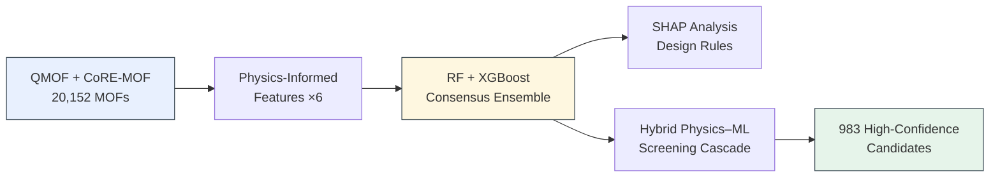
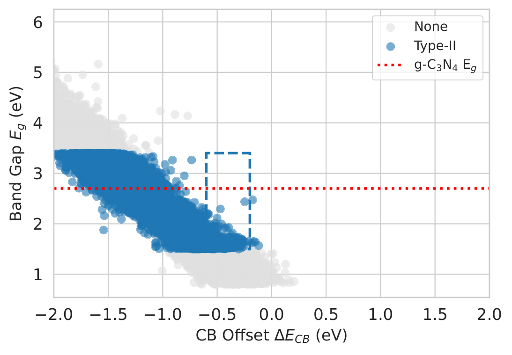
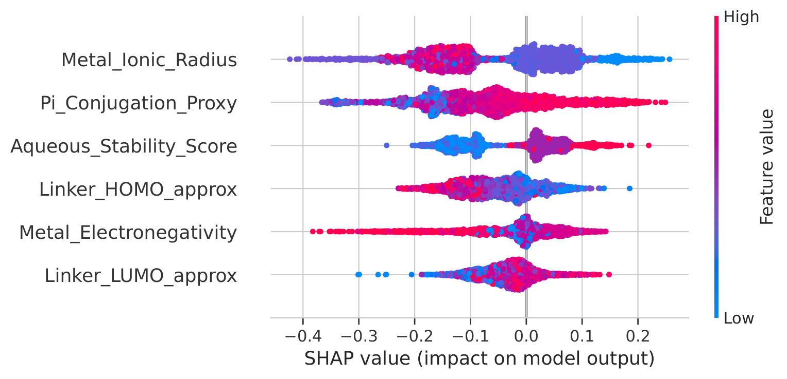
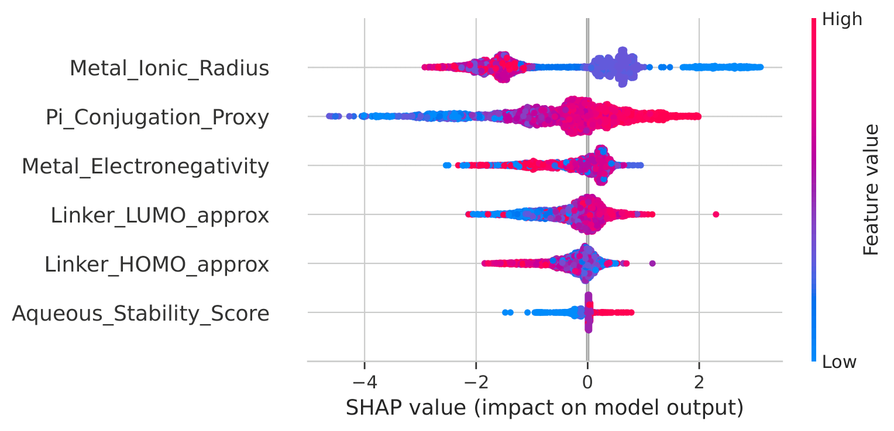
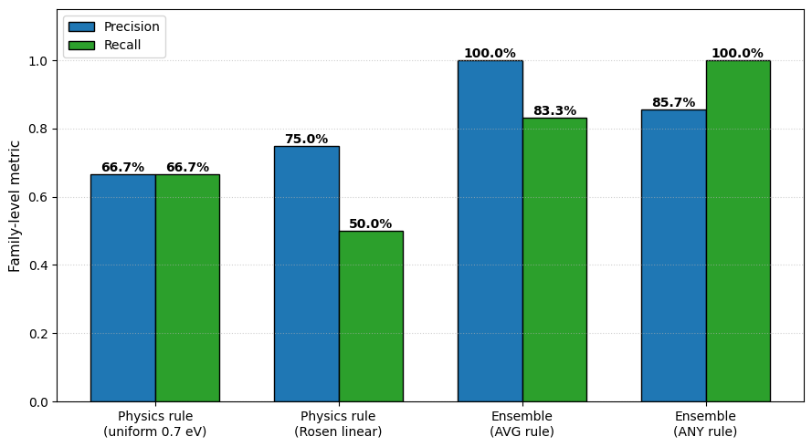

<div align="center">

# Physics-Informed Machine Learning Screening and Validation of MOF/g-C₃N₄ Heterojunction Photocatalysts

[](https://doi.org/10.1016/j.cjph.2026.07.025)
[](https://doi.org/10.1016/j.cjph.2026.07.025)
[](LICENSE)
[](https://www.python.org/)

**Abdullah Khan**, Muhammad Saeed, Fakhrud Din*, Farhat Ullah, Sami Ullah*

*University of Malakand · KFUPM (Saudi Arabia) · Bahrain Polytechnic*

</div>

> [!NOTE]
> 📄 Published in the **Chinese Journal of Physics** — Q1 (Physics, Multidisciplinary) · Impact Factor **5.3** · CiteScore **7.9**
> DOI: [10.1016/j.cjph.2026.07.025](https://doi.org/10.1016/j.cjph.2026.07.025)

> [!IMPORTANT]
> This pipeline screens **20,152 MOFs → 983 high-confidence candidates** for photocatalytic water splitting, cutting quantum-chemistry screening cost by **~20.5×** — with **98% precision** in the top-50 ranked candidates.

---

## Overview

Fewer than 5% of tested semiconductors meet the coupled requirements for visible-light
photocatalytic water splitting. Screening the 20,000+ candidate MOF/g-C₃N₄ Type-II
heterojunctions with hybrid-functional DFT would cost **>10⁷ CPU-hours**. This work
bypasses that bottleneck with **physics-informed machine learning**: six interpretable
descriptors derived from Sanderson electronegativity theory and the Butler–Mulliken
band-alignment formalism, computed directly from composition — no per-structure
quantum calculations required.



<div align="center">

<br><em>Screening window: visible-light absorption vs. Type-II driving force</em>
</div>

## Key Results

| Metric | Value |
|---|---|
| ROC-AUC — consensus ensemble (4,029-structure test set) | **0.912** |
| Top-50 screening precision (hybrid cascade) | **98%** |
| External validation — family-level recall (11 closed-shell families) | **100%** |
| External validation — precision | **85.7%** |
| Accuracy lift vs. physics-rule baselines | **+27.6 pp** (McNemar *p* = 0.004) |
| Screening funnel | 20,152 → **983** candidates |
| Cost reduction vs. exhaustive HSE06 screening | **~20.5×** |

✅ Correctly identifies **MOF-5, UiO-66, NU-1000, NH₂-MIL-53(Al)** as compatible (P = 0.75–0.99)
❌ Correctly rejects **ZIF-8** (UV-only) and **Cu-BTC** (aqueously unstable)

## Explainable AI: Design Rules

SHAP analysis identified **metal ionic radius** and **linker π-conjugation** as the
dominant compatibility factors:

<div align="center">


</div>

<details>
<summary><b>🔬 Synthesis guidance extracted from the model (click to expand)</b></summary>
<br>

- **Metal nodes:** Ti / Zr / Fe with ionic radius **60–75 pm** — optimal band alignment and stability (~30% compatibility)
- **Frameworks:** high-stability **aluminum-halide** families dominate the top-ranked candidates
- **Linkers:** electron-donating aromatics (C/H = 1.2–1.5, **π-conjugation > 0.45**); saturated aliphatics (e.g., ZIF-type) are unfavorable
- **Functionalization:** –NH₂ / –OH groups red-shift absorption by **0.3–0.7 eV** via mesomeric donation
- **Porosity:** pore limiting diameter **> 3.5 Å** for reactant accessibility
- **Hard floor:** aqueous stability score ≥ 3 — no electronic advantage rescues a hydrolytically unstable framework

</details>

## External Validation

Leakage-controlled protocol: **17 experimentally characterized MOF families (40
structures)** isolated from training, tuning, and model selection via
chemical-fingerprint matching. On the closed-shell subset, the ensemble beats both
physics-rule baselines by **+27.6 percentage points** at the structure level:

<div align="center">

</div>

## Repository Structure

├── data/ # Dataset integration (QMOF + CoRE-MOF) — see Data section <br>
├── notebooks/ # Feature engineering, training, screening, SHAP analysis<br>
├── results/ # Paper figures and output tables<br>
├── requirements.txt<br>
└── README.md<br>


## Data

Original data sources (both CC-BY-4.0):

| Source | Access |
|---|---|
| QMOF Database v1.0 (20,372 MOFs, DFT properties) | [figshare](https://doi.org/10.6084/m9.figshare.13147324) |
| CoRE-MOF 2019 (~14,000 curated structures) | [Zenodo](https://doi.org/10.5281/zenodo.3677685) |

## Installation & Reproduction

```bash
git clone https://github.com/khanaiml/mof-gcn-ml-screening.git
cd mof-gcn-ml-screening
pip install -r requirements.txt
```

Run the notebooks in pipeline order; each states its inputs and outputs at the top.

<details>
<summary><b>📖 Citation (click to expand)</b></summary>

```bibtex
@article{Khan2026MOF,
  title   = {Physics-Informed Machine Learning Screening and Validation of
             Metal-Organic Framework/g-C3N4 Heterojunction Photocatalysts},
  author  = {Khan, Abdullah and Saeed, Muhammad and Din, Fakhrud and
             Ullah, Farhat and Ullah, Sami},
  journal = {Chinese Journal of Physics},
  year    = {2026},
  doi     = {10.1016/j.cjph.2026.07.025}
}
```

</details>

---

<div align="center">

**Abdullah Khan** — abdullahkhan.prof@gmail.com

[](https://www.linkedin.com/in/mrabdullahkhan)
[](https://www.kaggle.com/abdullahkhan161101)

</div>
